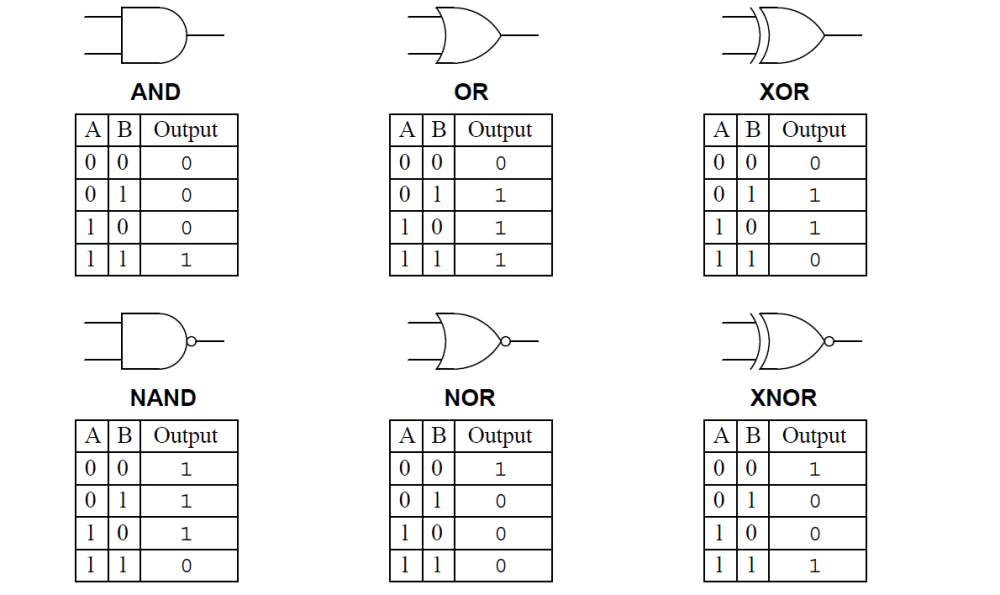

### Cấu trúc rời rạc

- Số chính phương là bình phương của 1 số nguyên(căn bậc hai là 1 số nguyên)
- Mệnh đề phức hợp: mệnh đề được ghép lại từ nhiều mệnh đề con thông qua liên từ
- XOR: Hoặc Phép tuyển chặt PvQ, đọc là P hoặc Q , là mệnh đề chỉ đúng khi chân trị cả 2 khác nhau
- NAND: Phép kéo theo "p kéo theo q" - mệnh đề kéo theo chỉ sai khi p đúng và q đúng

1/ 

2/ AND , OR , XOR

3/ NAND

### Lập trình hướng đối tượng
- Thông dịch: dịch và thực thi từng dòng
- Biên dịch: dịch toàn bộ source code thành file exe  
- Tính chất hướng đối tượng:
    + Kế thừa: nhưng sự vật , sự việc, đối tượng có các thuộc tính chung nhưng vẫn có những tính chất riêng , nên ở đó ta tách ra thành 1 đối tượng mang các thuộc tính, phương thức chung, và khai báo các đối tượng độc lập mang các thuộc tính riêng của mỗi đối tượng
    Ví dụ: con chó, con mèo, có thuộc tính chung là chạy, ăn, ngủ, cân nặng, nhưng con chó và mèo có thuộc tính riêng là tiếng kêu,
    thì ta khai báo lớp động vật mang các thuộc tính: chạy, ăn, ngủ, cân nặng, lớp con chó và lớp con mèo kế thừa lớp động vật, nhưng có tiếng kêu riêng thuộc về mỗi con
    Trong java sử dụng từ khoá extends đề kế thừa: <lớp con> extends <lớp cha>
    + Đóng gói: che dấu các thuộc tính không cho bên ngoài tác động vào, và chỉ trong bản thân đối tượng mới được thao tác với thuộc tính đó
    Trong java sử dụng từ khoá private
    + Đa hình: 1 đối tượng có thể có nhiều hình thái khác nhau , ví dụ: động vật có nhiều biểu hiện như con chó, con mèo, con trâu..
    + Trừu tượng: các tính chất, hành vi của đối tượng được mô tả 1 cách không cụ thể mà chỉ có các tính chất, hành vi chung chung, ví dụ khi nói động vật 
    và thuộc tính ăn, ngủ, cân nặng, chiều cao, nhưng ta không biết đó là động vật cụ thể nào trong thế giới thực , nếu nêu cụ thể động vật là con chó thì ta có thể hình dung và liên tưởng ngay để biết động vật là gì, trong java trừu tượng thông qua từ khoá abstract 
     
- Overriding: khi cần thay đổi hành vi, phương thức của lớp con khác với phương thức kế thừa từ lớp cha , ví dụ 
    + con chó kế thừa từ lớp động vật, có phương thức là tiếng kêu kế thừa từ lớp động vật thì trả ra kết quả là "gâu gâu", tương tự với
  mèo thì trả ra "meo meo"
- Overloading: các phương thức có cùng tên nhưng khác tham số hoặc khác tham số và khác kiểu trả về
    + public string tiengkeu(a int, b int), public string tiengkeu(a int, b int, int c), 2 phương thức này cùng tên nhưng khác tham số , 1 cái 2, 1 cái 3 tham số truyền vào

    